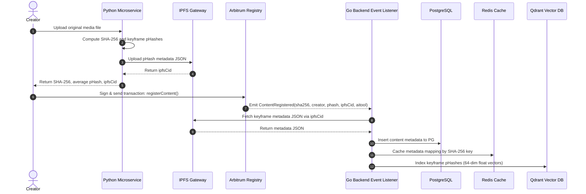
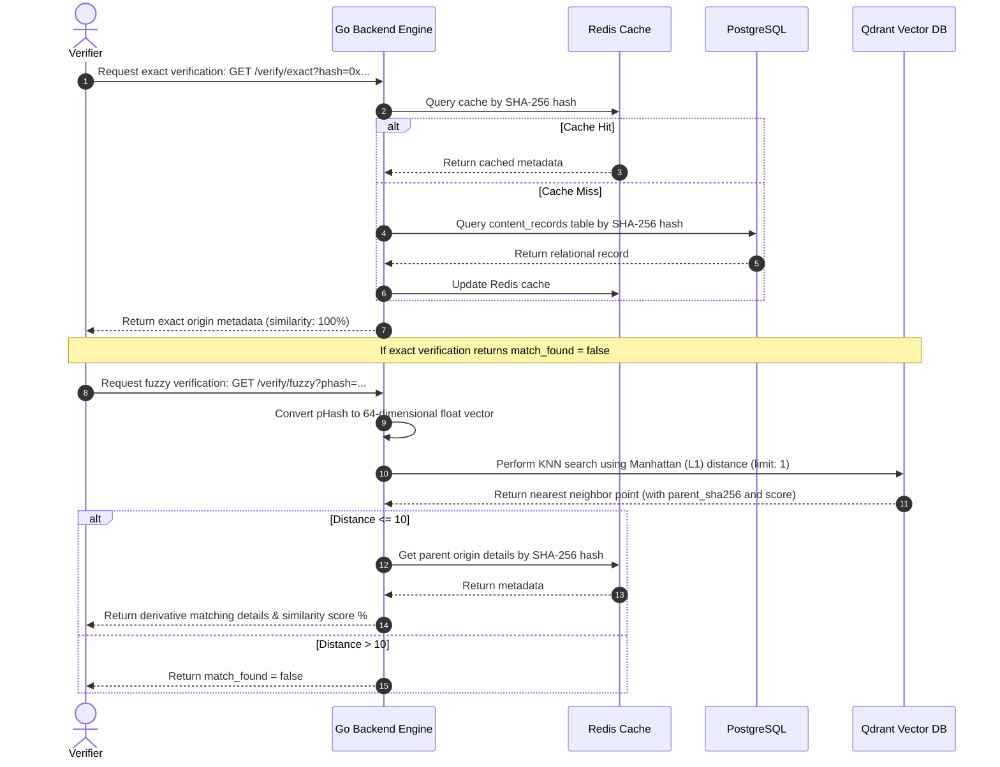

# VeriTrace Core Backend Engine

This repository contains the core orchestration, database metadata management, and high-speed fuzzy search engine for **VeriTrace** (Blockchain-Backed Content Provenance). 

The backend acts as the router connecting our on-chain registry (deployed on Arbitrum Sepolia), off-chain storage metadata, and the local database caching/vector indices.

---

## Technical Stack & Ports
* **Language**: Go (v1.26.1)
* **Framework**: Gin Gonic (HTTP REST API)
* **Database**: PostgreSQL v15 (Relational Store)
* **Cache**: Redis v7 (Exact-match cache)
* **Vector DB**: Qdrant (gRPC connection for Hamming-distance KNN search)
* **Web3 Integration**: Go-Ethereum (WebSocket event logs parser)

---

## Directory Architecture

We use a layered modular architecture pattern (**Repository -> Service -> Handler -> App Router**) to keep database details decoupled from routing endpoints:

```text
.
├── cmd/
│   └── server/
│       └── main.go           # Orchestrates server startup and dependency injection
├── config/
│   └── config.go            # Reads and parses config from environment/.env
├── internal/
│   ├── api/
│   │   └── router.go        # Configures Gin router and registers verification endpoints
│   ├── content/
│   │   ├── repository.go    # Data accessor interface for Postgres, Redis, and Qdrant
│   │   ├── service.go       # Core business logic: registers events, processes verification
│   │   └── handler.go       # Handles HTTP requests for exact/fuzzy lookups
│   ├── database/
│   │   ├── postgres.go      # Initializes Postgres pool & handles auto-migrations
│   │   └── redis.go         # Initializes Redis connection client
│   ├── health/
│   │   ├── repository.go    # Health check probe interfaces
│   │   ├── service.go       # Probes Postgres and Redis connection health
│   │   └── handler.go       # Exposes /health probe endpoint
│   ├── listener/
│   │   ├── evm_listener.go  # Persistent EVM block log filter subscription
│   │   └── pipeline.go      # Worker pipeline parsing events and routing to Service
│   └── vector/
│       └── qdrant.go        # Establishes gRPC client and automates index migrations
├── migrations/              # Auto-run SQL schemas for Postgres tables
├── Dockerfile               # Multi-stage container compilation configuration
└── docker-compose.yml       # Local orchestration stack setup
```

---

## System Flows

### 1. The Registration Flow



---

### 2. The Verification Flow



---

## Getting Started

### 1. Configure Environment Variables
Create a `.env` file in the root directory (copy from `.env.example`):

```env
CONTRACT_ADDRESS=0x468edc5b2fe9d1c919f2377cbe0ccb16f32ead29
PORT=8080

DB_HOST=localhost
DB_PORT=5432
DB_USER=postgres
DB_PASSWORD=postgres
DB_NAME=veritrace
DB_SSLMODE=disable

REDIS_HOST=localhost
REDIS_PORT=6379
REDIS_PASSWORD=
REDIS_DB=0

QDRANT_HOST=localhost
QDRANT_PORT=6334

ARBITRUM_SEPOLIA_WS_URL=wss://arb-sepolia.g.alchemy.com/v2/YOUR_ALCHEMY_KEY
```

---

### 2. Boot Local Services (Docker)
Start the entire local infrastructure: Postgres, Redis, Qdrant, and the Go application:

```bash
docker compose up -d --build
```

The Go application automatically waits for the PostgreSQL database container to pass its `pg_isready` healthcheck, executes all database migrations, creates the Qdrant collections/indexes, and starts listening for blockchain events.

---

### 3. Verify Server Status
Once the containers are running, query the health check endpoint:

```bash
curl http://localhost:8080/health
```

Expected Response:
```json
{
  "status": "UP",
  "database": "UP",
  "redis": "UP"
}
```

---

## API Documentation

### 1. Exact Verification
* **Endpoint**: `GET /api/v1/verify/exact`
* **Query Parameters**:
  * `hash`: The SHA-256 hash of the media file (e.g., `0x6ca0...`).
* **Example Query**:
  ```bash
  curl "http://localhost:8080/api/v1/verify/exact?hash=0x6ca0f85e3618e276dffd6d4ea07f14e35570c3b1d041e1378b074aa0054e5d18"
  ```
* **Example Response**:
  ```json
  {
    "match_found": true,
    "exact_match": true,
    "similarity": 100,
    "record": {
      "Sha256Hash": "0x6ca0f85e3618e276dffd6d4ea07f14e35570c3b1d041e1378b074aa0054e5d18",
      "CreatorAddress": "0xd94059F8276bb9F3aF2fA86f7D2B237c519F1919",
      "PHash": 9876543210123,
      "Timestamp": 1783445355,
      "IpfsCid": "QmYwAPJzv5CZ1aA5xrxPAjXX1cYk87t7XN7Cpd1Egw2a5B",
      "AiTool": "DALL-E 3"
    }
  }
  ```

---

### 2. Fuzzy Verification (Fuzzy Search)
* **Endpoint**: `GET /api/v1/verify/fuzzy`
* **Query Parameters**:
  * `phash`: The 64-bit integer visual perceptual hash of the file.
* **Example Query**:
  ```bash
  curl "http://localhost:8080/api/v1/verify/fuzzy?phash=9876543210123"
  ```
* **Example Response**:
  ```json
  {
    "match_found": true,
    "exact_match": false,
    "similarity": 98.4375,
    "timestamp_offset": 145,
    "record": {
      "Sha256Hash": "0x6ca0f85e3618e276dffd6d4ea07f14e35570c3b1d041e1378b074aa0054e5d18",
      "CreatorAddress": "0xd94059F8276bb9F3aF2fA86f7D2B237c519F1919",
      "PHash": 9876543210123,
      "Timestamp": 1783445355,
      "IpfsCid": "QmYwAPJzv5CZ1aA5xrxPAjXX1cYk87t7XN7Cpd1Egw2a5B",
      "AiTool": "DALL-E 3"
    }
  }
  ```
