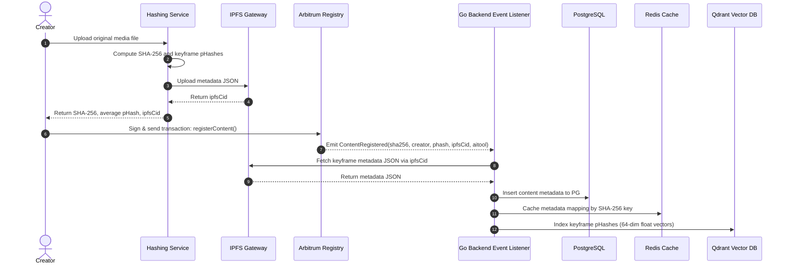
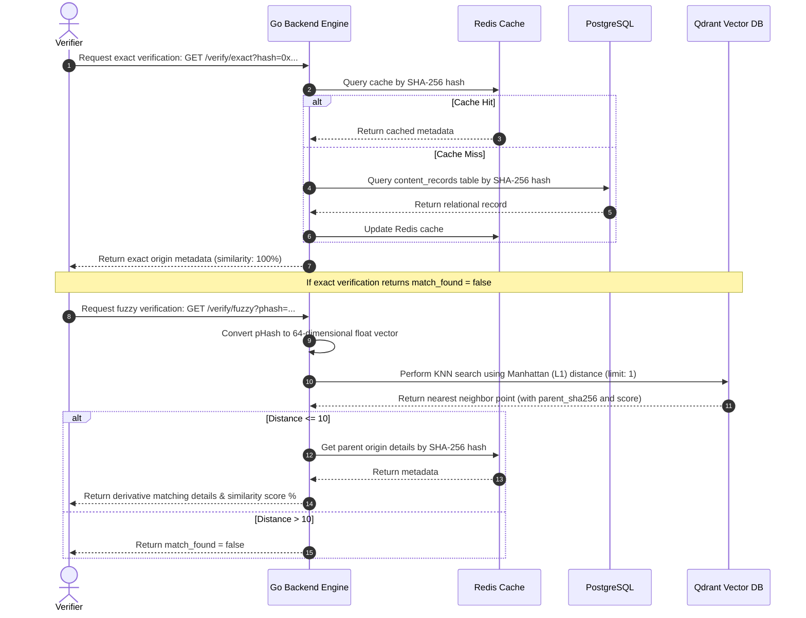
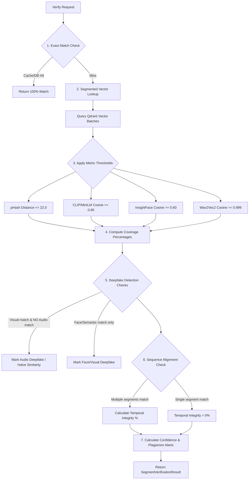

# VeriTrace Core Backend Engine

[](https://go.dev/)
[](https://gin-gonic.com/)
[](https://www.postgresql.org/)
[](https://redis.io/)
[](https://qdrant.tech/)

The **VeriTrace Core Backend Engine** is the orchestration hub, database manager, and fuzzy/exact search engine for the **VeriTrace** content provenance ecosystem. It connects the Layer-2 on-chain Arbitrum Sepolia smart contract registry, decentralized metadata storage (IPFS), local caching systems, and high-performance vector databases for near-instantaneous content verification.

---

## Codebase Context
Below is the link reference to the core files in this repository:
- **Server Entrypoint**: [main.go](cmd/server/main.go)
- **Routing Engine**: [router.go](internal/api/router.go)
- **Database Configurations**: [postgres.go](internal/database/postgres.go) | [redis.go](internal/database/redis.go)
- **Vector DB Client**: [qdrant.go](internal/vector/qdrant.go)
- **Blockchain Event Listener**: [evm_listener.go](internal/listener/evm_listener.go) | [pipeline.go](internal/listener/pipeline.go)
- **Core Provenance Business Logic**: [service.go](internal/content/service.go) | [repository.go](internal/content/repository.go) | [handler.go](internal/content/handler.go)
- **Configuration Parsing**: [config.go](config/config.go)

---

## Problem Statement

Integrating decentralized ledgers (like blockchain) into high-performance web applications is inherently slow and complex:
1. **Latency**: Direct on-chain calls (EVM lookups) take seconds to resolve, which is unacceptable for real-time applications or browser extensions checking hundreds of images on a page.
2. **Complex Querying**: Blockchains do not support fuzzy text searches, visual perceptual searches, or vector similarity lookups. They only support exact-key matches.
3. **Data Retrieval Overhead**: Content metadata (like author info, creation tools, and verification timestamps) stored on IPFS requires multi-second fetch periods over HTTP gateways, leading to poor user experience.

---

## Solution Overview

The Core Backend acts as a high-speed off-chain synchronization and caching layer that bridges Web3 immutability with Web2 responsiveness:
- **EVM Event Syncing**: A background event listener runs constantly, filtering events emitted by the Arbitrum Sepolia contract. When it detects `ContentRegistered`, it automatically downloads the corresponding JSON metadata from IPFS, parses it, and writes it to a high-speed local database.
- **Hierarchical Caching**: Incoming exact-match verification requests hit a **Redis cache** first. If missed, they fall back to a relational **Postgres database** and update the cache, achieving sub-10ms response times.
- **Perceptual Vector Matching**: Perceptual hashes are split into multi-dimensional float arrays and indexed in **Qdrant Vector DB**. The backend performs KNN (K-Nearest Neighbor) lookups using Manhattan/L1 distance calculations to locate visually modified versions of original assets in milliseconds.
- **Segment-Based Video Alignment**: For documents and videos, the backend processes arrays of keyframe signatures, executing custom algorithms to locate matching sections and calculate overall edit similarity.

---

## Technology Stack

- **Primary Language**: Go (v1.26.1)
- **Web Framework**: **Gin Gonic (HTTP REST API)**
- **Relational Storage**: **PostgreSQL v15** (via `pgx` driver pool)
- **Caching Store**: **Redis v7** (key-value cache layer)
- **Vector Search Engine**: **Qdrant** (gRPC connection)
- **Web3 Blockchain Gateway**: **Go-Ethereum (geth)** RPC Client
- **Storage Integrations**: Pinata IPFS SDK & AWS S3/MinIO SDK

---

## Directory Architecture

The repository utilizes a clean, layered architectural pattern (**Repository -> Service -> Handler -> App Router**) to keep database transactions separated from routing endpoints:

```text
veritrace-core-backend/
├── cmd/
│   └── server/
│       └── main.go           # Orchestrates server startup and dependency injection
├── config/
│   └── config.go            # Reads and parses config from environment/.env
├── internal/
│   ├── api/
│   │   └── router.go        # Configures Gin router and registers verification endpoints
│   ├── content/
│   │   ├── repository.go    # Data accessor interface for Postgres, Redis, and Qdrant
│   │   ├── service.go       # Core business logic: registers events, processes verification
│   │   └── handler.go       # Handles HTTP requests for exact/fuzzy lookups
│   ├── database/
│   │   ├── postgres.go      # Initializes Postgres pool & handles auto-migrations
│   │   └── redis.go         # Initializes Redis connection client
│   ├── health/
│   │   ├── repository.go    # Health check probe interfaces
│   │   ├── service.go       # Probes Postgres and Redis connection health
│   │   └── handler.go       # Exposes /health probe endpoint
│   ├── listener/
│   │   ├── evm_listener.go  # Persistent EVM block log filter subscription
│   │   └── pipeline.go      # Worker pipeline parsing events and routing to Service
│   └── vector/
│       └── qdrant.go        # Establishes gRPC client and automates index migrations
├── migrations/              # Auto-run SQL schemas for Postgres tables
├── Dockerfile               # Multi-stage container compilation configuration
└── docker-compose.yml       # Local orchestration stack setup
```

---

## System Flows & Sequence Diagrams

### 1. Asset Registration Flow (EVM Syncing)

```mermaid
sequenceDiagram
    autonumber
    actor Creator
    participant Hashing as Hashing Service
    participant IPFS as IPFS Gateway
    participant Contract as Arbitrum Registry
    participant Go as Go Backend Event Listener
    participant PG as PostgreSQL
    participant Redis as Redis Cache
    participant Qdrant as Qdrant Vector DB

    Creator->>Hashing: Upload original media file
    Hashing->>Hashing: Compute SHA-256 and keyframe pHashes
    Hashing->>IPFS: Upload metadata JSON
    IPFS-->>Hashing: Return ipfsCid
    Hashing-->>Creator: Return SHA-256, average pHash, ipfsCid
    Creator->>Contract: Sign & send transaction: registerContent()
    Contract-->>Go: Emit ContentRegistered(sha256, creator, phash, ipfsCid, aitool)
    Go->>IPFS: Fetch keyframe metadata JSON via ipfsCid
    IPFS-->>Go: Return metadata JSON
    Go->>PG: Insert content metadata to PG
    Go->>Redis: Cache metadata mapping by SHA-256 key
    Go->>Qdrant: Index keyframe pHashes (64-dim float vectors)
```

### 2. Asset Verification Flow

```mermaid
sequenceDiagram
    autonumber
    actor Verifier
    participant Go as Go Backend Engine
    participant Redis as Redis Cache
    participant PG as PostgreSQL
    participant Qdrant as Qdrant Vector DB

    Verifier->>Go: Request exact verification: GET /verify/exact?hash=0x...
    Go->>Redis: Query cache by SHA-256 hash
    alt Cache Hit
        Redis-->>Go: Return cached metadata
    else Cache Miss
        Go->>PG: Query content_records table by SHA-256 hash
        PG-->>Go: Return relational record
        Go->>Redis: Update Redis cache
    end
    Go-->>Verifier: Return exact origin metadata (similarity: 100%)

    Note over Verifier, Qdrant: If exact verification returns match_found = false
    
    Verifier->>Go: Request fuzzy verification: GET /verify/fuzzy?phash=...
    Go->>Go: Convert pHash to 64-dimensional float vector
    Go->>Qdrant: Perform KNN search using Manhattan (L1) distance (limit: 1)
    Qdrant-->>Go: Return nearest neighbor point (with parent_sha256 and score)
    alt Distance <= 10
        Go->>Redis: Get parent origin details by SHA-256 hash
        Redis-->>Go: Return metadata
        Go-->>Verifier: Return derivative matching details & similarity score %
    else Distance > 10
        Go-->>Verifier: Return match_found = false
    end
```

---

## Environment Variable Requirements

Set the following variables in a `.env` file inside the project directory (based on `.env.example`):

```env
# The deployed Arbitrum Sepolia contract address
CONTRACT_ADDRESS=0xeb09ca3b844693817479cf33fd88cdf02c2711fd

# Backend listener and router port
PORT=8080

# PostgreSQL credentials
DB_HOST=localhost
DB_PORT=5432
DB_USER=postgres
DB_PASSWORD=postgres
DB_NAME=veritrace
DB_SSLMODE=disable

# Redis credentials
REDIS_HOST=localhost
REDIS_PORT=6379
REDIS_PASSWORD=
REDIS_DB=0

# Qdrant Vector DB gRPC Endpoint
QDRANT_HOST=localhost
QDRANT_PORT=6334

# EVM Node Gateway Websocket URL (e.g. Alchemy, Infura, or Quicknode)
ARBITRUM_SEPOLIA_WS_URL=wss://arb-sepolia.g.alchemy.com/v2/YOUR_ALCHEMY_KEY

# Pinata JWT for IPFS Pinning Operations
PINATA_JWT=your_pinata_jwt_token

# S3 Backup/Archival credentials (MinIO for local development)
S3_ENDPOINT=http://localhost:9000
S3_PUBLIC_ENDPOINT=http://localhost:9000
S3_ACCESS_KEY=minioadmin
S3_SECRET_KEY=minioadmin
S3_BUCKET=veritrace
S3_REGION=us-east-1
UPLOAD_BASE_URL=http://localhost:8080/uploads
```

---

## Setup & Local Run Instructions

### 1. Run via Docker Compose (Recommended)
This will set up PostgreSQL, Redis, Qdrant, and start the Go server inside a docker network automatically:
```bash
docker compose up -d --build
```
On boot, the Go server automatically:
1. Waits for PostgreSQL to be ready.
2. Runs schema auto-migrations.
3. Automatically creates Qdrant index collections.
4. Spawns the websocket listener connecting to Arbitrum Sepolia.

### 2. Manual Development Run
If you have local instances of Postgres, Redis, and Qdrant running:
```bash
# Install Go dependencies
go mod download

# Start the server
go run cmd/server/main.go
```

---

## How to Test and Verify

Once the server is booted, verify the service endpoints using `curl`:

### 1. Health Probe
Check connections to PostgreSQL and Redis:
```bash
curl http://localhost:8080/health
```
**Expected Response**:
```json
{
  "status": "UP",
  "database": "UP",
  "redis": "UP"
}
```

### 2. Verify Exact Match (SHA-256)
Search the registry database and cache for an exact matching SHA-256 hash:
```bash
curl "http://localhost:8080/api/v1/verify/exact?hash=0x6ca0f85e3618e276dffd6d4ea07f14e35570c3b1d041e1378b074aa0054e5d18"
```
**Example Response**:
```json
{
  "match_found": true,
  "exact_match": true,
  "similarity": 100,
  "record": {
    "Sha256Hash": "0x6ca0f85e3618e276dffd6d4ea07f14e35570c3b1d041e1378b074aa0054e5d18",
    "CreatorAddress": "0xd94059F8276bb9F3aF2fA86f7D2B237c519F1919",
    "PHash": 9876543210123,
    "Timestamp": 1783445355,
    "IpfsCid": "QmYwAPJzv5CZ1aA5xrxPAjXX1cYk87t7XN7Cpd1Egw2a5B",
    "AiTool": "DALL-E 3"
  }
}
```

### 3. Verify Fuzzy Match (pHash similarity)
Perform a K-NN vector lookup in Qdrant based on a visual perceptual hash:
```bash
curl "http://localhost:8080/api/v1/verify/fuzzy?phash=9876543210123"
```
**Example Response**:
```json
{
  "match_found": true,
  "exact_match": false,
  "similarity": 98.4375,
  "timestamp_offset": 0,
  "record": {
    "Sha256Hash": "0x6ca0f85e3618e276dffd6d4ea07f14e35570c3b1d041e1378b074aa0054e5d18",
    "CreatorAddress": "0xd94059F8276bb9F3aF2fA86f7D2B237c519F1919",
    "PHash": 9876543210123,
    "Timestamp": 1783445355,
    "IpfsCid": "QmYwAPJzv5CZ1aA5xrxPAjXX1cYk87t7XN7Cpd1Egw2a5B",
    "AiTool": "DALL-E 3"
  }
}
```

---

### 4. Segmented Match Verification (Videos & Documents)
Perform multi-segmented verification matching keyframes, face vectors, speech audio patterns, and document text blocks.
* **Endpoint**: `POST /api/v1/verify/segments`
* **Content-Type**: `application/json`
* **Request Body**:
  ```json
  {
    "sha256": "0x123...",
    "media_type": "video",
    "segments": [
      { "offset": 1, "phash": 567890123, "semantic_hash": [0.0123, -0.0456], "face_hashes": [[0.12, -0.34]] }
    ],
    "audio_hash": [0.05, -0.12, 0.24]
  }
  ```
* **Example Response**:
  ```json
  {
    "match_found": true,
    "exact_match": false,
    "similarity": 88.5,
    "matched_segments": 42,
    "total_segments_uploaded": 45,
    "total_segments_registered": 42,
    "coverage_uploaded_pct": 93.33,
    "coverage_registered_pct": 100.0,
    "is_deepfake": false,
    "is_audio_deepfake": false,
    "temporal_integrity": 95.8,
    "record": { ... }
  }
  ```

#### Detailed Matching Flow & Pipeline
When a query request is submitted to `/verify/segments` for a video, document, or audio file, the backend evaluates the media using a multi-layered verification pipeline:


```mermaid
graph TD
    Start["Verify Request"] --> ExactCheck{"1. Exact Match Check"}
    ExactCheck -->|Cache/DB Hit| Ret100["Return 100% Match"]
    ExactCheck -->|Miss| SegCheck["2. Segmented Vector Lookup"]
    SegCheck --> SearchQdrant["Query Qdrant Vector Batches"]
    SearchQdrant --> CheckThresholds{"3. Apply Metric Thresholds"}
    
    CheckThresholds --> pHashMatch["pHash Distance <= 22.0"]
    CheckThresholds --> SemanticMatch["CLIP/MiniLM Cosine >= 0.85"]
    CheckThresholds --> FaceMatch["InsightFace Cosine >= 0.60"]
    CheckThresholds --> AudioMatch["Wav2Vec2 Cosine >= 0.999"]
    
    pHashMatch & SemanticMatch & FaceMatch & AudioMatch --> CalcCoverage["4. Compute Coverage Percentages"]
    CalcCoverage --> DeepfakeFilter{"5. Deepfake Detection Checks"}
    
    DeepfakeFilter -->|Visual match & NO Audio match| SetAudioFake["Mark Audio Deepfake / Halve Similarity"]
    DeepfakeFilter -->|Face/Semantic match only| SetVisualFake["Mark Face/Visual Deepfake"]
    
    DeepfakeFilter --> OrderCheck{"6. Sequence Alignment Check"}
    OrderCheck -->|Multiple segments match| ComputeTemporal["Calculate Temporal Integrity %"]
    OrderCheck -->|Single segment match| SkipTemporal["Temporal Integrity = 0%"]
    
    ComputeTemporal & SkipTemporal --> FinalScore["7. Calculate Confidence & Plagiarism Alerts"]
    FinalScore --> End["Return SegmentVerificationResult"]
```

1. **Exact Match Check**: The system computes the file's SHA-256 hash. If there is a cache (Redis) or database (PostgreSQL) hit, the verification resolves immediately returning `similarity: 100%`.
2. **Segmented Vector Search**: If no exact match is found, the backend maps the uploaded segments' perceptual hashes (pHash), semantic embeddings, face vectors, and audio speech footprints. It performs batch queries against the Qdrant Vector database to locate matching segment points.
3. **Similarity Metric Thresholds & Percentage Equivalence**:
   - **pHash (Visual distance representation)**: Manhattan distance threshold of `<= 22.0`. In percentage terms, this maps to `((64.0 - distance) / 64.0) * 100.0`, translating to **`>= 65.625%`** visual similarity.
   - **Semantic Embedding (CLIP/MiniLM)**: Cosine similarity threshold of `>= 0.85`, translating directly to **`>= 85.0%`** semantic text/visual similarity.
   - **Face Embedding (InsightFace)**: Cosine similarity threshold of `>= 0.60`, translating directly to **`>= 60.0%`** face similarity.
   - **Audio Embedding (Wav2Vec2)**: Cosine similarity threshold of `>= 0.999`, translating directly to **`>= 99.9%`** vocal acoustic pattern similarity.
4. **Candidate Coverage Requirements**:
   - A candidate parent asset must meet coverage thresholds to prevent accidental matches:
     - **Visual Coverage** (matched segments / uploaded segments) `* 100 >= 5.0%`
     - **Face Coverage** (matched faces / uploaded faces) `* 100 >= 10.0%`
     - **Semantic Coverage** (matched text/visual semantics / uploaded segments) `* 100 >= 10.0%`
5. **Deepfake Detection Logic**:
   - **Audio deepfakes**: If visual frames match an original work (`visual >= 5%`), but the video contains audio signals (`len(audio_hash) > 0`) and zero audio segments match the parent (`audioCount == 0`), it is classified as an **Audio Deepfake (voice cloning)**. The overall similarity score is automatically halved (`similarity = similarity * 0.5`).
   - **Visual/Face deepfakes**: If visual coverage is low but a face match (`face >= 10%`) or a semantic meaning match (`semantic >= 10%`) triggers, it indicates an actor's face or styling has been artificially composited onto a third-party clip. The asset is labeled as a **Deepfake** and the confidence score is halved.
6. **Sequence Alignment (Temporal Integrity)**:
   - For visual matches, the system tracks the sequential order of the matched segments by examining their database `timestamp_offset`. 
   - It calculates a **temporal integrity score** (from `0%` to `100%`). If the clips appear in chronological sequence matching the original, the temporal integrity remains high. If frames are spliced, out of order, or scrambled, the temporal integrity drops towards 0%.
7. **Final Confidence Calculations**:
   - Blends similarity and temporal integrity: `confidenceScore = (similarity * 0.7) + (temporalIntegrity * 0.3)`.
   - Generates automatic real-time webhooks notifying original content creators if plagiarism or unauthorized deepfake derivatives are detected with `>= 80%` similarity.

